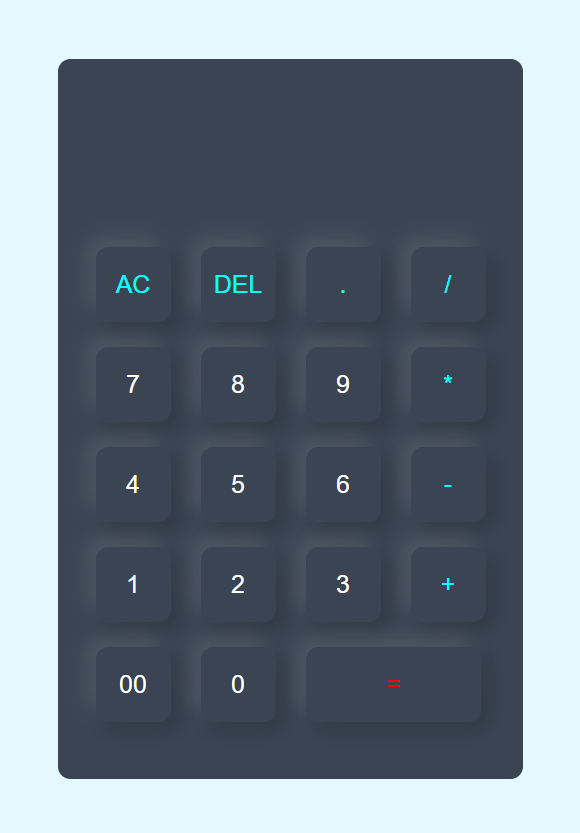

# Simple Calculator

This is a basic web-based calculator built using **HTML**, **CSS**, and **JavaScript**. It allows users to perform simple arithmetic operations such as addition, subtraction, multiplication, and division.



## 💡 Features

- Responsive layout for all screen sizes
- Basic arithmetic operations: `+`, `-`, `*`, `/`
- Clear (`AC`) and delete (`DEL`) functions
- Styled using modern CSS with a dark-themed UI

## 🚀 Getting Started

To run the calculator locally:

1. Clone the repository:
   ```bash
   git clone https://github.com/your-username/simple-calculator.git
   cd simple-calculator
2. Open the index.html file in your browser:
   ```bash
   open index.html
  Or just double-click the file in your file explorer.

📁 Project Structure
```bash
├── index.html      
├── style.css      
├── screenshot.png    
